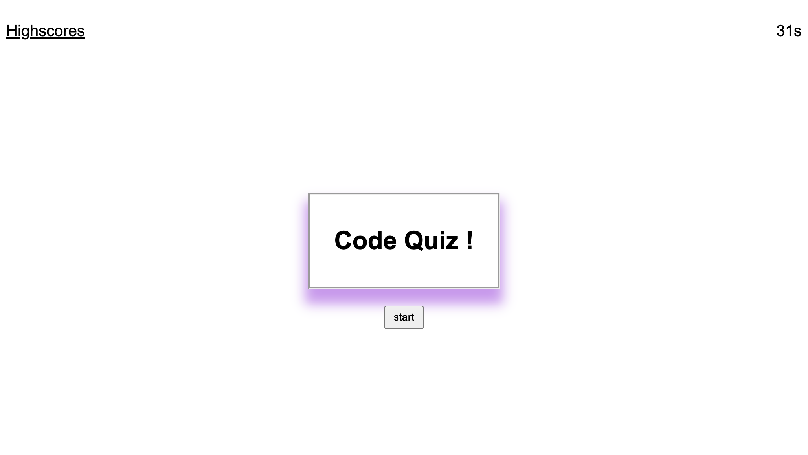
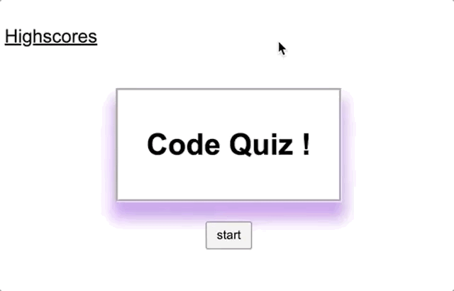

# Code-selfstudyquiz

Through Javascript I am able to create a timed quiz. 

---

## Table of Contents

* [Built with](#built-with)
* [Live link](#deployed-link)
* [Site Layout](#layout)
* [Functionality](#functionality)
* [Learning points](#learning-points)

---
## Built With

* [HTML](https://developer.mozilla.org/en-US/docs/Web/HTML)
* [CSS](https://developer.mozilla.org/en-US/docs/Web/CSS)
* [Javascript](https://developer.mozilla.org/en-US/docs/Web/JavaScript)
---
## Deployed Link

* [Code quiz](#)



---

## Layout

The page lay out is really simple in terms of CSS. Thiers a highscore, timer , and a title card with a start button.

---

## Functionality

### Timer 

When you press on the "start" button a timer will go off 




 > code source for timer function

```javascript

function timeEl() {
            // player has 1min or 60s to finish quiz.
        var timeleft =60;
      
        var timeInterval = setInterval(function () {
        
          timeleft--; 
          timer.textContent = timeleft + "s";
           // quiz stops when timer hits 0
          if(timeleft === 0) {
              console.log("Game over!")
      
            clearInterval(timeInterval);
    
          }
        }, 1000);
    };
   
```

### Saves Highscore

When user completes quiz, their score is the time left on the timer. and it saved locally.
I have yet to have localStorage.setItem()  
localStorage.getItem().


---


### quiz itself

main function of the application is that it should have questions appear withen the html. If user answers incorrectly 10 secounds is deducted from timer. making user loose points. I have yet to make the main function work.


---

### Learning points 

In this project I learned how to make use of a timer function. I also learned the importance of psudo code. Javascript isn't my best atribute right now. I had said that before about CSS. Now CSS is my favorite to work on. I know it's just a matter of time and effecient practice so that my javascript abilities can improve.

---

## License
for UC Berkely Extention bootcamp program

---
##### Author Joshua Meza
[GitHub](https://github.com/705h-S)